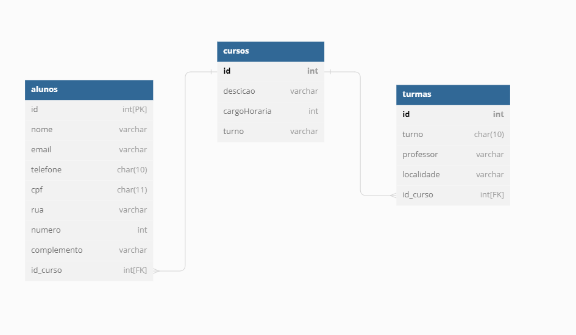

# SistemaAcompanhamento

  <ul>
        <h3>Entidades</h3>
            <li>Cursos</li>
            <li>Turmas</li>
            <li>Alunos</li>
    </ul>

    <h2>Existem outras entidades além dessas 3?</h2>
    
não

    <h2>Quais são os principais campos e tipos ?</h2>
    
Os principais campos são os Id´s , chaves primárias , e as chaves estrangeiras.

    <h2>Como essas entidades estão relacionadas ?</h2>
    
As chaves estrangeiras da tabela <strong> Aluno </strong> e <strong> Turmas </strong> 
        estão relacionadas a chave primária da tabela <strong>Cursos</strong>

    
    <h2>Modelagem do banco:</h2>
    
