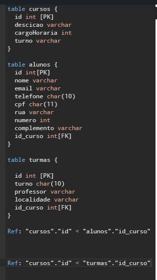

# SistemaAcompanhamento

## entidades
+ cursos
+ turmas
+ alunos

## Modelagem do banco

### Peguntas:

Existem outras entidades além dessas 3? não.
---
Quais são os principais campos e tipos? Id´s( chaves primárias) e as chaves estrangeiras.
---
Como essas entidades estão relacionadas? As chaves estrangeiras estão relacionadas com a chave primária da tabela Cursos.
---

# Ferramenta: DBdiagram
### https://dbdiagram.io/home

